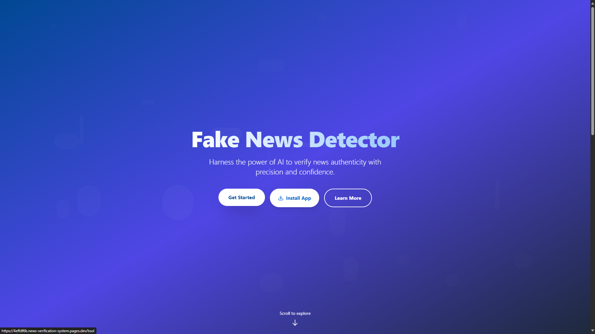
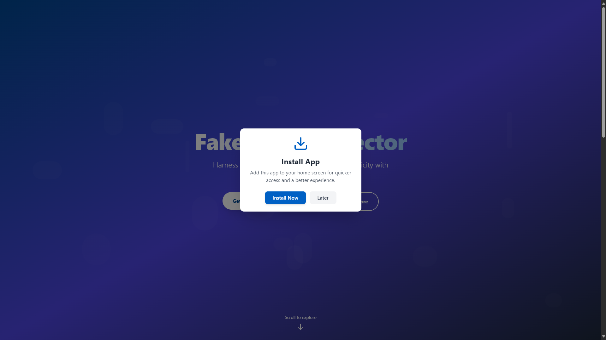
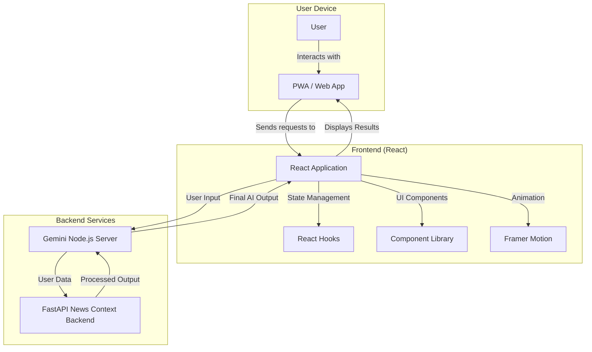
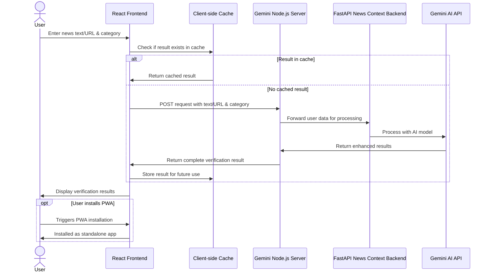
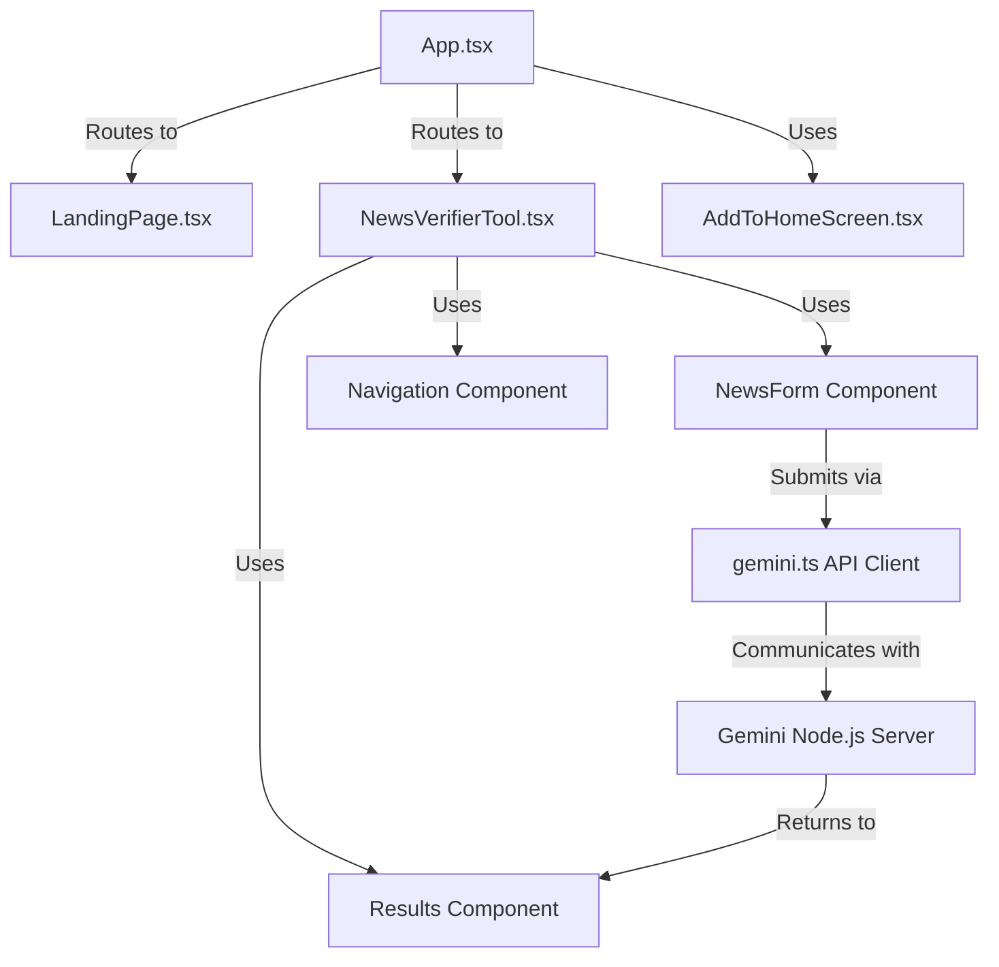

# Fake News Detector


> **Tip:** Explore how this AI-powered application is structured, built, and deployed to help combat misinformation.

## Overview

The Fake News Detector is a progressive web application that leverages AI to verify the authenticity of news articles. It provides users with a trust score, detailed analysis, potential biases, and recommendations based on the submitted news content or URL.

## Features
* **Trust Score Analysis** with detailed explanations
* **Supports both Text Input and URL Submission**
* **Category-specific verification algorithms**
* **Progressive Web App** for cross‑platform use
* **Client‑side caching of previous verifications**

## Demo
```bash
# Live Demo
https://news-verification-system.pages.dev
or
https://news-verify.0xarchit.is-a.dev
```

## Screenshots
  
  
  


## Architecture

The project follows a modern frontend-centric architecture with AI-powered backend services:

**Technology Stack Overview:**

1. **Frontend**: React application built with TypeScript and served as a Progressive Web App (PWA)
2. **API Integration**: Connects to a Gemini-powered API service for news verification

### System Diagram



### Complete Workflow Diagram

The following diagram illustrates the complete flow of a news verification request from user input to displaying results:



## Frontend Implementation

The frontend is a Progressive Web Application (PWA) built with React, TypeScript, and Tailwind CSS. It provides a responsive interface for users to interact with the news verification system.

### Key Components



### Main Pages

||| Landing Page
Marketing-focused page introducing the application with animated sections.
||| Tool Page
The functional page where users can submit news for verification.
|||

### Features

**Progressive Web App**: Install on any device

**Responsive Design**: Works across all screen sizes

**Smart Caching**: Stores previous verification results

**Modern UI**: Animated components using Framer Motion

**Efficient API Integration**: Optimized data transfer

## Component Breakdown

### Components

- **NewsVerifierTool**: Manages form state, API calls, results display, errors, loading states, and caching
- **NewsForm**: Handles input toggle (text/URL), news submission, and validation
- **Results**: Displays trust score, analysis, source links, biases, and recommendations
- **Navigation**: Responsive nav bar with mobile collapse behavior
- **AddToHomeScreen**: PWA install button and modal with event handling

## Backend & API Endpoints

The application uses two backend services with complementary roles:

### Node.js Gemini API Server

| Endpoint | Method | Description |
|----------|--------|-------------|
| `/api/verify-news` | POST | Main endpoint for news verification |
| `/api/health` | GET | Server health check |

#### Example API Request

```json
{
  "text": "news text or url",
  "category": "category string"
}
```

#### Example API Response

```json
{
  "trustScore": 85,
  "analysis": "This news article appears to be authentic based on cross-referencing with reliable sources.",
  "sourceandrelated": "Verified against sources: https://example.com/news1, https://example.com/news2. The article correctly reports on the key facts of the event.",
  "potentialBiases": ["Slight political leaning in terminology", "Emphasis on certain stakeholders"],
  "recommendation": "The article can be considered reliable, though readers should be aware of the slight bias in presentation."
}
```

### FastAPI News Context Backend

| Endpoint | Method | Description |
|----------|--------|-------------|
| `/api/analyze` | POST | Provides news context for AI verification |
| `/health` | GET | Server health check |
| `/docs` | GET | API documentation (Swagger UI) |

**Uptime Monitoring**:
[1. Backend Uptime Checker](https://backend.0xarchit.is-a.dev){target="_blank"}
[ 2. Backup Backend Uptime Checker](https://api.0xarchit.is-a.dev){target="_blank"}

### How it works
1. The frontend calls the Node.js `/api/verify-news` endpoint  
2. Node.js server fetches news context from FastAPI `/api/analyze`  
3. Node.js server uses Gemini AI to verify and analyze the news  
4. The result is returned to the frontend for display

## Implementation Details

### Caching Implementation
```typescript
// Global cache persists between route changes
const globalNewsDataCache: { [key: string]: any } = {};

function App() {
  // Use a ref to maintain reference to the global cache
  const newsDataCacheRef = useRef<{ [key: string]: any }>(globalNewsDataCache);
  
  // ...rendering logic
}
```

### Gemini Processing

Gemini AI orchestrates the core verification pipeline by:
- Fetching recent news context from the FastAPI endpoint (`/api/analyze`), which returns parsed headlines, descriptions, sources, and dates.
- Translating user‑submitted news into English (if needed).
- Computing text similarity using algorithms such as:
  - **TF‑IDF (Term Frequency-Inverse Document Frequency) + Cosine Similarity**: We vectorize both the user input and each context document to spot overlapping terms and measure relevance.
  - **Semantic Embeddings**: Leveraging pre‑trained language models to capture deeper contextual meaning beyond exact term matches.
  - **Keyword & Entity Matching**: Identifying shared entities (names, dates, locations) between the input and context.
- Aggregating these scores to derive a final **trustScore** (0–100).
- Generating a concise **analysis**, listing matched sources in **sourceandrelated**, detecting biases, and crafting a **recommendation**.

```typescript
// Pseudo‑flow inside Gemini
const contextDocs = await fetchFastApiContext(userText, category);
const userVec = tfidfVectorize(userText);
const contextVecs = contextDocs.map(doc => tfidfVectorize(doc.text));

const cosineScores = contextVecs.map(v => cosineSimilarity(userVec, v));
const semanticScores = contextDocs.map(doc => semanticSimilarity(userText, doc.text));

// Combine signals
const trustScore = aggregateScores(cosineScores, semanticScores, entityMatches);
const analysis = generateAnalysis(userText, contextDocs, trustScore);
const sourceandrelated = formatSources(contextDocs);
```

### API Integration
```typescript
export async function verifyNews(source: string, category: string) {
  const apiUrl = import.meta.env.VITE_GEMINIAPIURL;

  const response = await fetch(apiUrl, {
    method: "POST",
    headers: { "Content-Type": "application/json" },
    body: JSON.stringify({ text: source, category }),
  });

  if (!response.ok) {
    throw new Error(`Failed to verify news: ${response.statusText}`);
  }

  return await response.json();
}
```

### Response Schema

```typescript
interface VerificationResult {
  trustScore: number;      // 0-100 percentage
  analysis: string;        // Detailed text analysis
  sourceandrelated: string; // Source URLs and additional context
  potentialBiases: string[]; // List of identified biases
  recommendation: string;   // Actionable recommendation
}
```

## Tech Stack

### Frontend
- **React**: UI library for building component-based interfaces
- **TypeScript**: For type safety and improved developer experience
- **Tailwind CSS**: For utility-first styling
- **Framer Motion**: For sophisticated animations and transitions
- **React Router**: For client-side routing
- **Vite**: Fast build tool and development server
- **PWA**: Service workers and manifest for installable web app functionality

### Tools & Infrastructure
- **ESLint**: Code quality and consistency
- **PostCSS**: CSS processing with plugins
- **Cloudflare Pages/Vercel**: Potential deployment platforms

### Backend
- **Node.js & Express**: Main Gemini API server (`Gemini API Server`)
- **@google/generative-ai**: Gemini AI integration on Node.js
- **Python & FastAPI**: News-context backend (`FastAPI News Context Server`)
- **pydantic**: Request validation in FastAPI
- **aiohttp & BeautifulSoup4**: Fetch and parse news data
- **uvicorn**: ASGI server for FastAPI

## PWA Implementation

The project is configured as a Progressive Web App using the `vite-plugin-pwa` plugin:

```typescript
VitePWA({
  registerType: "autoUpdate",
  manifest: {
    name: "News Verifier",
    short_name: "NewsCheck",
    start_url: "/",
    display: "standalone",
    background_color: "#ffffff",
    theme_color: "#000000",
    icons: [{ src: "/image.png", sizes: "192x192", type: "image/png" }],
  },
  workbox: {
    globPatterns: ["**/*.{js,css,ico,png,svg}"],
    navigateFallback: "index.html",
    navigateFallbackDenylist: [/^\/api/],
  },
})
```

## Installation and Local Development

### Project Setup

```bash
# Clone the repository (Currently project is private*)
git clone https://github.com/0xarchit/fake-news-detector.git 

# Navigate to the project directory
cd fake-news-detector

# Install dependencies
npm install

# Create .env file with required variables
echo "VITE_GEMINIAPIURL=https://your-api-endpoint.com/verify" > .env

# Run the development server
npm run dev
```

### Environment Variables

```
VITE_GEMINIAPIURL=https://your-api-endpoint.com/verify
```

## Usage Guide

### Basic Usage

1. **Visit the Website**: Go to the deployed application
2. **Select Input Type**: Choose between text input or URL
3. **Enter News Content**: Paste the news article or URL
4. **Select Category**: Choose the relevant news category from education, politics, finance, etc.
5. **Submit**: Click "Verify News"
6. **Review Results**: Examine the trust score, analysis, and recommendations

### Installing as PWA

1. Visit the website in a compatible browser (Chrome, Edge, Safari, etc.)
2. Look for the "Install App" button or the installation prompt
3. Add the app to your home screen
4. Access the app directly from your device's home screen or app drawer

## Project Structure

```
fake-news-detector/
├── src/                    # Frontend source code
│   ├── components/         # React components
│   │   ├── Navigation.tsx  # Navigation bar component
│   │   ├── NewsForm.tsx    # News submission form
│   │   └── Results.tsx     # Results display component
│   ├── lib/                # Utility functions
│   │   └── gemini.ts       # API integration for news verification
│   ├── App.tsx             # Main app component with routing
│   ├── LandingPage.tsx     # Marketing landing page
│   ├── NewsVerifierTool.tsx # Main news verification tool
│   └── AddToHomeScreen.tsx # PWA installation component
├── public/                 # Static assets and PWA resources
│   ├── _redirects          # SPA redirect configuration
│   ├── manifest.json       # PWA manifest
│   └── image.png           # App icon
├── vite.config.ts          # Vite & PWA configuration
├── tailwind.config.js      # Tailwind CSS configuration
├── tsconfig.json           # TypeScript configuration
└── package.json            # Project dependencies
```

## Development Guidelines

###  Code Style

- Use TypeScript for type safety
- Follow functional React patterns with hooks
- Implement responsive design for all screen sizes
- Use semantic HTML elements for better accessibility
- Follow the project's ESLint configuration

### Project Structure

- Keep components focused on a single responsibility
- Use custom hooks for shared logic
- Implement proper error handling throughout the application
- Document complex logic with comments
- Use consistent naming conventions

## Performance Optimizations

**PWA Caching**: Critical assets are cached for offline use  
**Client-side Caching**: Previous verification results are stored to minimize API calls  
**Lazy Loading**: Components and routes could be lazy-loaded for faster initial load  
**Animations**: Optimized with hardware acceleration where possible  
**Build Optimization**: Production builds are optimized for size and performance

## Future Enhancements
- User Accounts – Allow users to save verification history and preferences
- Browser Extensions – Create browser extensions for verifying news directly on news websites
- Multiple Languages – Support verification in different languages
- Explanation Features – Add more detailed explanations of verification methods
- Historical Context – Provide historical context for news topics to improve verification accuracy
- Citation Verification – Verify citations and references within news articles
- Machine Learning Model – Implement a custom machine learning model instead of Gemini that trains automatically on search data via this website

## Troubleshooting

### Common Issues

- **API Connection Errors**: Check internet connection and API endpoint configuration
- **Installation Issues**: Ensure HTTPS and PWA support in your browser
- **Rendering Problems**: Clear browser cache to resolve UI issues
- **Form Submission Errors**: Make sure all required form fields are completed

## Contact & Support
* [GitHub](https://github.com/0xarchit)
* [Email](mailto:mail@0xarchit.is-a.dev)

## License

This project is licensed under the MIT License - see the [LICENSE](LICENSE) file for details.
